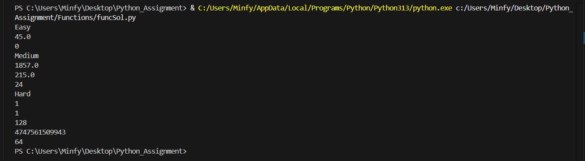
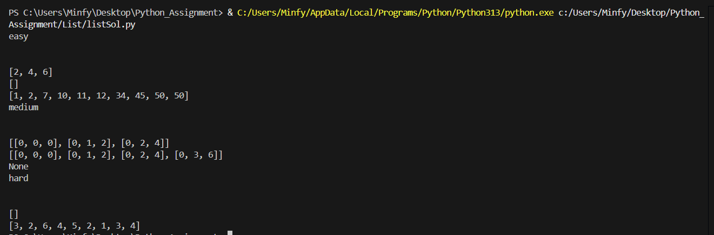

## Python Assignment

### Function
#### 🖼️ Output Screenshot

### List
#### 🖼️ Output Screenshot

### Tuples
#### 🖼️ Output Screenshot

### Dictionary
#### 🖼️ Output Screenshot

### OOPs
#### 🖼️ Output Screenshot

